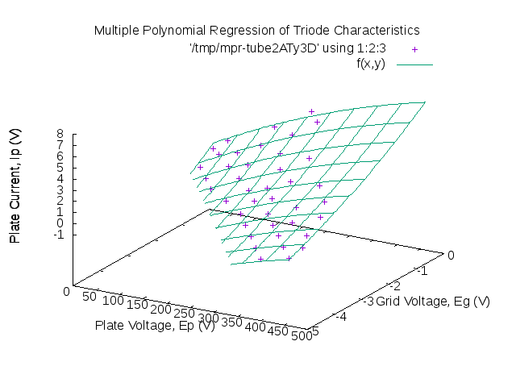

<h1>What even is this?</h1>

This repository is a lot of things. It's a first attempt at using the GSL to
  do something useful, it's an experiment to combine knowledge of circuits,
  amplifiers, scientific computing, and audio applications, and it's also to
  make a statement (more on that later).

This repository uses the GSL's implementation of the Levenberg-Marquardt
  algorithm to perform a multiple polynomial regression of empirical data
  measured from the pins of a 12AX7 Triode under load. The tool finds a surface
  that best matches the data given, of the form:

Where the vector Beta is the vector of regression coefficients, Eg is the
  grid voltage, Ep is the plate voltage, and Ig is the grid current.

<em>But this is only the start.</em> In the future, this program will do
  so much more. It will generate statistical data providing information about
  the fit. It will provide a simple interface to compute the function, and its
  Jacobian, and it will provide optimal values for discrete components based on
  a few inputs provided by the user. It will be used to gauge the accuracy of the
  datasheet, and to provide frequency analyses of circuits, comparisons of
  different tubes, and so much more. Stay updated as this program grows.

Here is an example of the kind of output that this function can generate:

Directory Structure:

<ul>
  <li>src/ - C, Python, and Perl source files</li>
  <li>gnuplot/ - GNUPlot scripts</li>
  <li>data/ - Tube data</li>
  <li>doc/ - LaTeX/HTML documentation</li>
</ul>
#
TODO: Add support for providing a filename. Add support for turning off
#	 callback in log. Add support for providing three params in csv.
#	 Add support for comments in .csv

<h2>Sources</h2>
<ul>
  <li>www.electronics-notes.com</li>
</ul>
